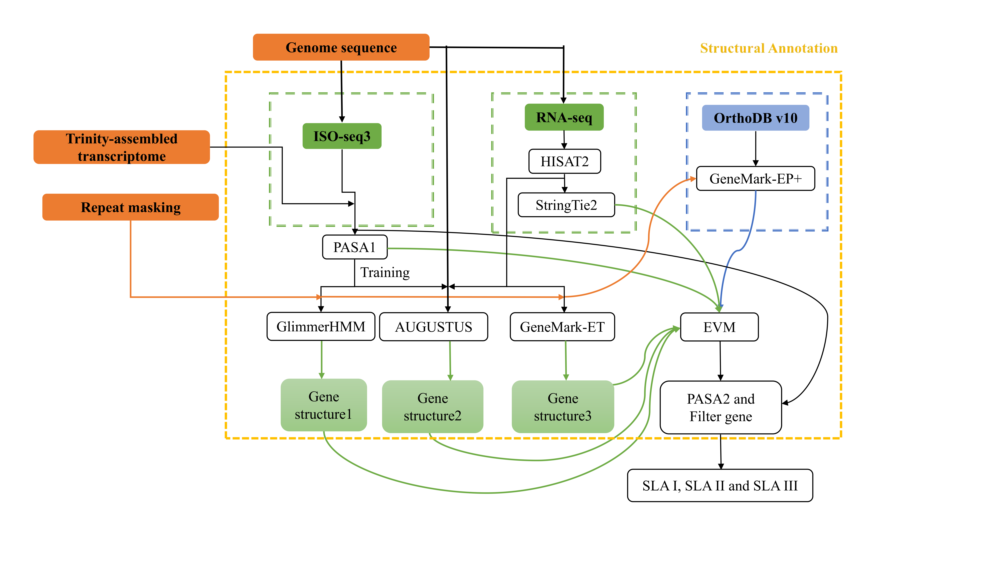

# 🧬 HACGA1  
**An Integrated, Evidence-Driven Genome Annotation Pipeline**

HACGA1 is an advanced, fully automated gene structural annotation pipeline specifically designed for **eukaryotic genomes**. It seamlessly integrates *ab initio gene prediction*, *transcriptome-based evidence*, and *homology-based inference* within a unified and reproducible workflow.

Implemented in Python and exclusively deployed via Docker, the pipeline guarantees cross-platform consistency, reproducibility, and minimal configuration requirements for environmental setup.

---

## ✨ Key Features

- End-to-end automated genome annotation
- Integration of multiple annotation strategies:
  - **Ab initio prediction**: AUGUSTUS, GlimmerHMM, GeneMark-ET
  - **Transcript evidence**: RNA-seq, HISAT2,StringTie2, PASA, TransDecoder
  - **Homology evidence**: GeneMark-EP+ with protein alignments
- Integrative evidence consolidation and consensus gene model construction using EvidenceModeler (EVM)
- Refinement of untranslated regions (UTRs) and alternative splicing isoforms through PASA
- Docker-based deployment to ensure computational reproducibility and environment standardization
- Parallelized execution with multi-threading capabilities and management for high-performance computing environments
- Modular pipeline architecture with comprehensive error handling to enhance robustness and maintainability

---

## 🧠 Pipeline Overview

HACGA1 conducts genome annotation through the following principal stages:

1. Genome preprocessing and sequence partitioning to enable parallel computation.
2. RNA-seq read alignment and transcript assembly using HISAT2 and StringTie2.
3. De novo transcriptome assembly and subsequent refinement via Trinity and PASA.
4. Open reading frame (ORF) prediction employing TransDecoder.
5. Gene structure prediction based on multiple complementary approaches, including:
   - AUGUSTUS
   - GlimmerHMM
   - GeneMark-ET and GeneMark-EP+
6. Integration of multi-source evidence using EvidenceModeler (EVM).
7. Final refinement of gene models, annotation of untranslated regions (UTRs), and correction of alternative splicing events utilizing PASA.

A schematic representation of the HACGA1 workflow is shown below:



---

## 📦 Deployment & Requirements

HACGA1 supports **Docker-based deployment only**.

### System Requirements
- Docker Engine
- Docker Compose

### Mandatory Requirement
- A valid **GeneMark license key**

> ⚠️ GeneMark is required for gene prediction. The pipeline will not run without a valid license.

---

## 🔑 GeneMark License Setup

1. Apply for a GeneMark license via the official GeneMark website or GeneMark@home.
2. Upon approval, save the license key to the following location:

```markdown
~/.gm_key
```

## 🚀 Installation

**1.Clone the repository:**

```shell
git clone https://github.com/liqianQ1/HACGA1.git
cd HACGA1
```

**2.Download GeneMark software and license:**

Before building the Docker image, you need to obtain **GeneMark-ES/ET/EP+** software and its license:

1. Go to the official GeneMark website: https://genemark.bme.gatech.edu/GeneMark/license_download.cgi
2. Apply for the software package and license.
3. Make sure to choose:
   - **Version:** 4.73_lic
   - **Platform:** LINUX 64-bit (Kernel 2.6 – 4)

After downloading, place the installation files and license in the appropriate folder of this project  and rename the folder to `gmes_linux_64`.

**3.Build the Docker image:**

```shell
docker compose build
```

------

## ▶️ Running HACGA1

Test data can be obtained via the **https://doi.org/10.6084/m9.figshare.31743703**.

~~~bash
wget "https://figshare.com/ndownloader/files/62818186"
unzip test_data.zip
~~~

Adjust the mounted data directory to align with your local data structure.

```shell
docker run --rm \
  -v ./test_data:/data \
  -v ~/.gm_key:/home/hacga_user/.gm_key \
  hacga:1.0 \
  python /pipeline/annotation_gene/ann_gene.py \
  --Outputdir /data \
  --Genome /data/tab/genome.tab \
  --Homolog /data/tab/homolog.tab \
  --RNAseq /data/tab/RNAseq.tab \
  --EST /data/tab/EST.tab \
  --max_parallel 8
```

------

## 📥 Input Data

HACGA1 necessitates the following categories of input:

- Genome sequence and repeat annotations
- RNA-seq read data
- Trinity-assembled transcript sequences
- Homologous protein sequences
- Configuration files and evidence weight parameters

Comprehensive descriptions of the required input formats are provided in:

```
docs/data_format.md
```

------

## 📤 Output Overview

The pipeline produces well-structured outputs corresponding to each stage of the annotation process, including:

- RNA-seq–based transcript annotations
- De novo gene predictions
- Homology-supported gene models
- Consensus gene structures integrated using EvidenceModeler (EVM)
- PASA-refined gene models incorporating untranslated regions (UTRs) and alternative splicing events

Comprehensive descriptions of output formats and directory organization are documented in:

```
docs/data_format.md
```

------

## ⚠️ Important Notes

### Persistence of Trained AUGUSTUS Models

Trained AUGUSTUS models are retained within the container environment and will be permanently removed upon deletion of the container.

- Default internal path:

```
/opt/conda/envs/ann/config/
```

- Recommended persistent storage location:

```
/data/augustus_models/
```

### File Path Configuration
Paths in `tab` files must use the mounted container path (e.g., `/data/...`), not the local host path.

### Character Restriction
All input data must use English characters only. Non-English characters are not supported.

### No Symbolic Links
All input files must be regular files. Symbolic links are not supported as they may not resolve correctly inside the Docker container.

------

## 📖 Citation

If you use HACGA1 in your research, please cite the underlying tools and databases employed by this pipeline, including:

- AUGUSTUS
- GeneMark
- GlimmerHMM
- HISAT2
- StringTie
- Trinity
- PASA
- EvidenceModeler

------

## 📬 Support & Contact

For questions, bug reports, or feature requests, please open an issue on GitHub.

------

**HACGA1** — *A scalable and reproducible solution for high-quality genome annotation.*
